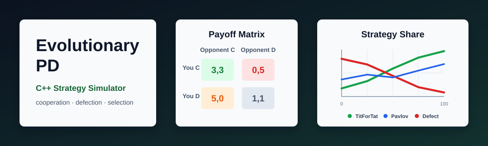

# Evolutionary Prisoner's Dilemma Simulator



> 《이기적 유전자》와 《협력의 진화》를 읽고 떠오른 질문을 C++ 시뮬레이션으로 실험하는 포트폴리오 프로젝트입니다.  
> **이기적인 개체들만 있어도 협력은 진화할 수 있을까?**

## 프로젝트 소개

《이기적 유전자》를 읽으며 이기적인 유전자와 협력의 관계가 궁금해졌습니다. 이어서 《협력의 진화》에서 반복 죄수의 딜레마와 전략 간 경쟁을 접했고, 단순한 설명을 넘어 직접 실험해보고 싶었습니다.

이 프로젝트는 여러 전략을 가진 개체들이 세대를 거치며 경쟁하고 번식하는 과정을 C++로 구현합니다. 각 세대의 전략 분포와 평균 점수는 CSV로 저장되고, Python Streamlit 대시보드에서 시각화할 수 있습니다.

## 핵심 질문

**"각 개체가 자기 점수만 높이려 해도, 반복되는 관계 속에서 협력은 살아남을 수 있는가?"**

## 구현 기능

- 반복 죄수의 딜레마 시뮬레이션
- 6가지 전략 구현: AlwaysCooperate, AlwaysDefect, TitForTat, GrimTrigger, RandomStrategy, Pavlov
- 모든 개체 쌍의 반복 경기
- 점수 기반 다음 세대 재생산
- 돌연변이 확률 적용
- 세대별 전략 개체 수와 평균 점수 CSV 저장
- Streamlit 기반 결과 대시보드
- assert 기반 C++ 테스트 코드
- CMake 빌드 지원

## 시뮬레이션 규칙

기본 보상 행렬은 전형적인 죄수의 딜레마 값을 사용합니다.

| 내 행동 | 상대 행동 | 내 점수 |
|---|---:|---:|
| 협력 | 협력 | R = 3 |
| 배신 | 협력 | T = 5 |
| 협력 | 배신 | S = 0 |
| 배신 | 배신 | P = 1 |

기본 설정은 [config/default_config.json](config/default_config.json)에 적혀 있습니다.

| 항목 | 기본값 |
|---|---:|
| 초기 개체 수 | 100 |
| 세대 수 | 100 |
| 한 경기당 라운드 수 | 100 |
| 돌연변이 확률 | 0.02 |
| 난수 시드 | 42 |

보상 행렬은 [include/PayoffMatrix.hpp](include/PayoffMatrix.hpp)에서 쉽게 바꿀 수 있습니다.

## 전략 설명

| 전략 | 설명 | 협력 관점 |
|---|---|---|
| AlwaysCooperate | 항상 협력합니다. | 착취당하기 쉽지만 협력자의 기준선입니다. |
| AlwaysDefect | 항상 배신합니다. | 단기 이익은 크지만 반복 관계에서 고립될 수 있습니다. |
| TitForTat | 첫 라운드는 협력하고 이후 상대 직전 행동을 따라 합니다. | 관대하지만 보복도 합니다. |
| GrimTrigger | 상대가 한 번이라도 배신하면 이후 계속 배신합니다. | 배신 억제력이 강하지만 용서하지 않습니다. |
| RandomStrategy | 확률적으로 협력 또는 배신합니다. | 예측 불가능한 기준선입니다. |
| Pavlov | 좋으면 유지하고 나쁘면 바꿉니다. | 시행착오로 관계를 조정합니다. |

## 프로젝트 구조

```text
evolutionary-prisoners-dilemma/
├── CMakeLists.txt
├── README.md
├── requirements.txt
├── .gitignore
├── assets/
│   └── banner.svg
├── config/
│   └── default_config.json
├── data/
│   └── .gitkeep
├── results/
│   └── .gitkeep
├── include/
│   ├── Action.hpp
│   ├── PayoffMatrix.hpp
│   ├── Strategy.hpp
│   ├── Player.hpp
│   ├── Game.hpp
│   ├── Population.hpp
│   ├── Simulation.hpp
│   └── CsvWriter.hpp
├── src/
│   ├── main.cpp
│   ├── PayoffMatrix.cpp
│   ├── Strategy.cpp
│   ├── Player.cpp
│   ├── Game.cpp
│   ├── Population.cpp
│   ├── Simulation.cpp
│   └── CsvWriter.cpp
├── scripts/
│   ├── run_simulation.py
│   └── dashboard.py
└── tests/
    └── test_core.cpp
```

## 파일별 책임

| 파일 | 책임 |
|---|---|
| [Action.hpp](include/Action.hpp) | 협력/배신 행동을 `enum class`로 정의합니다. |
| [PayoffMatrix.hpp](include/PayoffMatrix.hpp) | 보상 행렬 R, T, S, P를 관리합니다. |
| [Strategy.hpp](include/Strategy.hpp) | 전략 부모 클래스와 구체 전략들을 정의합니다. |
| [Player.hpp](include/Player.hpp) | 전략과 누적 점수를 가진 개체를 표현합니다. |
| [Game.hpp](include/Game.hpp) | 두 개체의 반복 죄수의 딜레마 경기를 실행합니다. |
| [Population.hpp](include/Population.hpp) | 세대 전체 개체, 통계, 번식을 관리합니다. |
| [Simulation.hpp](include/Simulation.hpp) | 초기화부터 CSV 저장까지 전체 실험 흐름을 연결합니다. |
| [CsvWriter.hpp](include/CsvWriter.hpp) | 세대별 결과를 CSV로 저장합니다. |
| [main.cpp](src/main.cpp) | 프로그램 시작점이며 설정값과 Simulation을 연결합니다. |

## 설치 방법

필요한 도구:

- C++17 지원 컴파일러
- CMake 3.16 이상
- Python 3.9 이상

Python 대시보드 패키지 설치:

```bash
pip install -r requirements.txt
```

## 실행 방법

### 1. CMake로 직접 실행

```bash
cmake -S . -B build
cmake --build build
./build/evo_pd
```

Windows PowerShell에서는 실행 파일 이름이 보통 다음과 같습니다.

```powershell
.\build\evo_pd.exe
```

### 2. Python 스크립트로 빌드와 실행 자동화

```bash
python scripts/run_simulation.py
```

### 3. 대시보드 실행

```bash
streamlit run scripts/dashboard.py
```

## 결과 CSV 예시

실행 후 [results/history.csv](results/history.csv)가 생성됩니다.

```csv
generation,AlwaysCooperate,AlwaysDefect,TitForTat,GrimTrigger,RandomStrategy,Pavlov,avg_score
0,20,17,16,13,18,16,2.4860
1,14,23,18,15,12,18,2.4241
...
```

`avg_score`는 라운드당 평균 보상처럼 해석하기 쉽도록 정규화한 값입니다.

## Dashboard Screenshot

아래 위치에는 실제 대시보드 스크린샷을 추가할 수 있습니다.

```md

```

현재는 `streamlit run scripts/dashboard.py`로 직접 실행해 확인하면 됩니다.

## 배운 C++ 개념

| 개념 | 이 프로젝트에서 쓰인 위치 |
|---|---|
| 변수, 조건문, 반복문 | 전략 선택, 보상 계산, 세대 반복 |
| 함수 | 보상 계산, CSV 저장, 번식 로직 분리 |
| `struct` | `PayoffMatrix`, `SimulationConfig`, `StrategyStats`처럼 단순 데이터 묶음 |
| `class` | `Strategy`, `Player`, `Game`, `Population`, `Simulation`처럼 책임을 가진 객체 |
| `enum class` | `Action`, `StrategyType`으로 정해진 선택지를 안전하게 표현 |
| `vector` | 개체 목록과 행동 기록을 동적 배열로 관리 |
| `map` | 전략별 개체 수와 점수 통계 집계 |
| `random` | 초기 전략 선택, RandomStrategy, 돌연변이, 부모 선택 |
| `algorithm` | `find`, `max` 같은 표준 알고리즘 |
| `numeric` | `accumulate`로 평균 점수 계산 |
| `fstream` | CSV 파일 저장과 테스트 파일 읽기 |
| `filesystem` | 결과 폴더 생성과 테스트 파일 정리 |
| CMake | 여러 C++ 파일을 하나의 실행 파일과 테스트로 빌드 |

## 이 프로젝트에서 연습할 수 있는 알고리즘/자료구조

- `vector`를 이용한 동적 배열 관리
- `map`을 이용한 전략별 통계 집계
- 모든 개체 쌍을 순회하는 이중 반복문
- 누적합으로 평균 계산하기
- 가중치 기반 확률 선택
- 난수 생성과 확률 분포 사용
- CSV 파일 입출력
- 반복 시뮬레이션 구조 설계

## 새 전략 추가하기

1. [include/Strategy.hpp](include/Strategy.hpp)의 `StrategyType`에 새 전략 이름을 추가합니다.
2. 같은 파일에 `Strategy`를 상속한 새 클래스를 선언합니다.
3. [src/Strategy.cpp](src/Strategy.cpp)에 `decideAction()` 구현을 추가합니다.
4. `allStrategyTypes()`, `strategyTypeToString()`, `createStrategy()`에 새 전략을 등록합니다.
5. 다시 빌드하고 CSV 컬럼에 새 전략이 등장하는지 확인합니다.

## 테스트 실행

```bash
cmake -S . -B build
cmake --build build
ctest --test-dir build
```

테스트 내용:

- 보상 행렬 계산
- AlwaysCooperate 행동
- AlwaysDefect 행동
- TitForTat의 직전 행동 따라 하기
- CSV 저장

## 발생할 수 있는 오류와 해결 방법

| 오류 | 해결 방법 |
|---|---|
| `cmake: command not found` | CMake를 설치하고 터미널을 다시 엽니다. |
| C++ 컴파일러를 찾을 수 없음 | Windows는 Visual Studio Build Tools 또는 MinGW를 설치합니다. |
| `streamlit`을 찾을 수 없음 | `pip install -r requirements.txt`를 실행합니다. |
| `results/history.csv`가 없음 | 먼저 `python scripts/run_simulation.py`를 실행합니다. |
| 실행 파일 경로가 다름 | Windows는 `build/Debug/evo_pd.exe`에 생성될 수 있습니다. 이 경우 CMake generator 설정을 확인하거나 직접 해당 경로를 실행합니다. |

## 향후 개선 아이디어

- JSON 설정을 C++에서 직접 읽도록 확장
- 전략별 평균 점수도 CSV에 추가
- 여러 실험을 한 번에 실행해 결과 비교
- 네트워크 구조를 넣어 이웃끼리만 대결
- GUI 또는 웹 기반 파라미터 조절
- 더 많은 Axelrod 토너먼트 전략 추가
- 대시보드 스크린샷을 `assets/`에 추가

## 참고한 책

- Richard Dawkins, *The Selfish Gene*
- Robert Axelrod, *The Evolution of Cooperation*

## 라이선스와 이미지

[assets/banner.svg](assets/banner.svg)는 이 프로젝트를 위해 직접 만든 SVG 이미지입니다. 외부 이미지를 사용하지 않았으므로 별도 이미지 라이선스 이슈가 없습니다.
